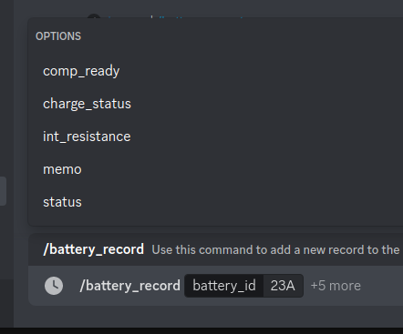
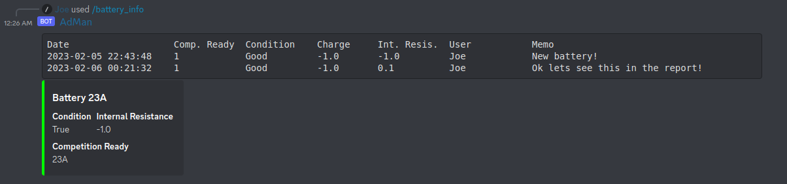
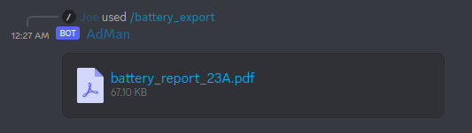

Admin Bot
#########

This section comes from the AdminBot repo: https://github.com/FRC-1721/AdminBot

General Commands
================

Battery Commands
================

In an attempt to make the discord bot slightly more useful, we've taken advantage of its 
easy to use interface and simple automation to record and catalog important information
about the team's batteries.

Please see the following commands for information on how to use each of the available commands.
Have a good build season!

battery_record
--------------

The `/battery_record` command logs a single entry into the battery management system. It **requires**
at least the `battery_id`, witch is a 3 letter code comprised of the battery acquisition year, and a letter.
I.E. `23A`, `23B`.. and so on.

Note that only the `battery_id` is required but there are several other fields, such as:

+------------------+------------------------------------------+
| `comp_ready`     | Marks this battery as comp_ready or not, |
+------------------+------------------------------------------+
| `charge_status`  | The battery beak charge status.          |
+------------------+------------------------------------------+
| `int_resistance` | The battery beak internal resistance.    |
+------------------+------------------------------------------+
| `status`         | The battery beak overall status          |
+------------------+------------------------------------------+
| `memo`           | Any notes you'd like to add!             |
+------------------+------------------------------------------+

battery_info
------------

`/battery_info` gives a quick at-a-glance look at a battery's logs. Coloring the output as well to
alert the reader if the battery is comp ready or not.

battery_export
--------------

Another super useful command! Battery export has two formats, `CSV` (A spreadsheet) or `PDF` (What might be handy
to include in the team docs, hint hint!)

battery_purge
--------------

Not meant for normal use! If a battery is "retired" the thing to do is to use :ref:`battery_record` and mark the
battery as not competition ready, and post the MEMO with a note saying so. However, in a pinch. You can delete
all logs for a battery using this command.

Note, there is no autocompletion here. You must explicitly type in the battery ID
